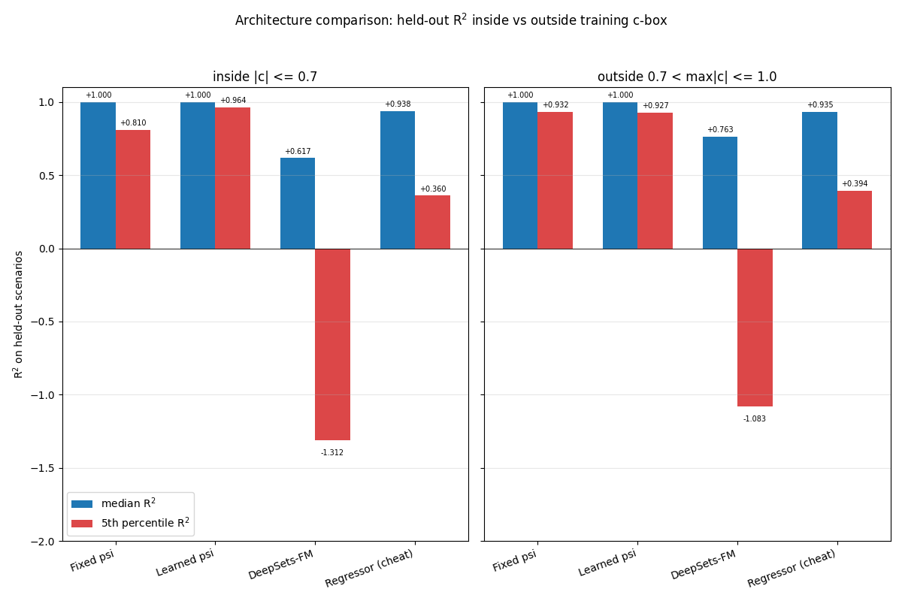
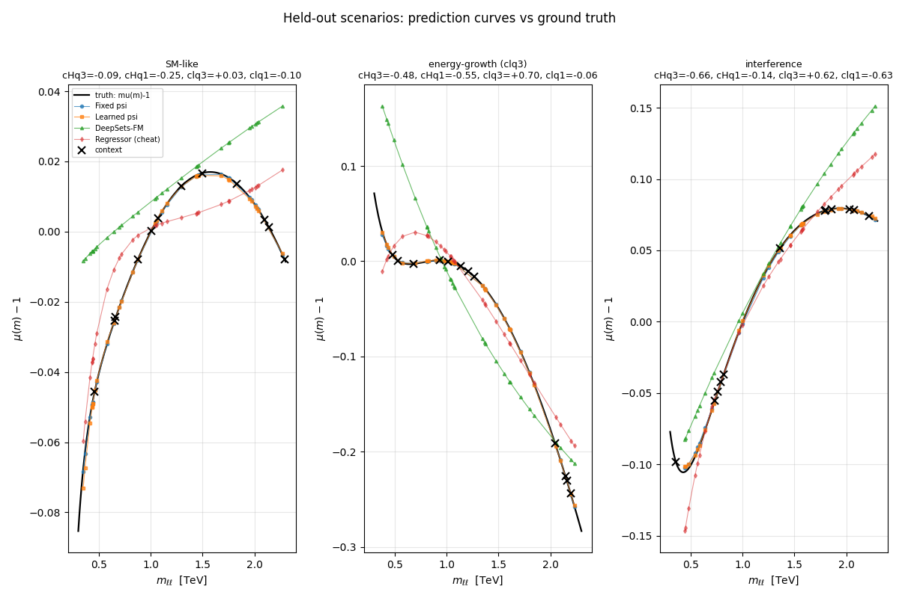
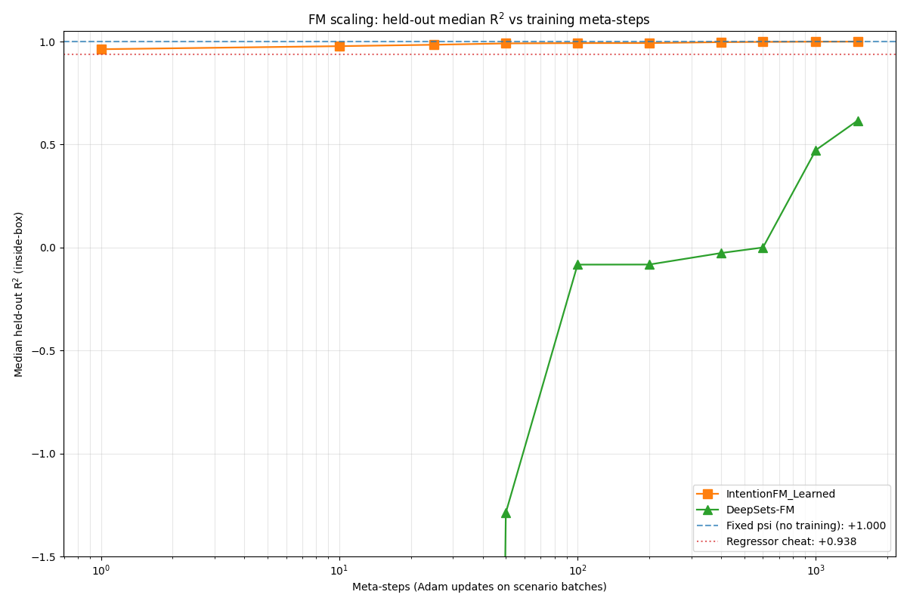
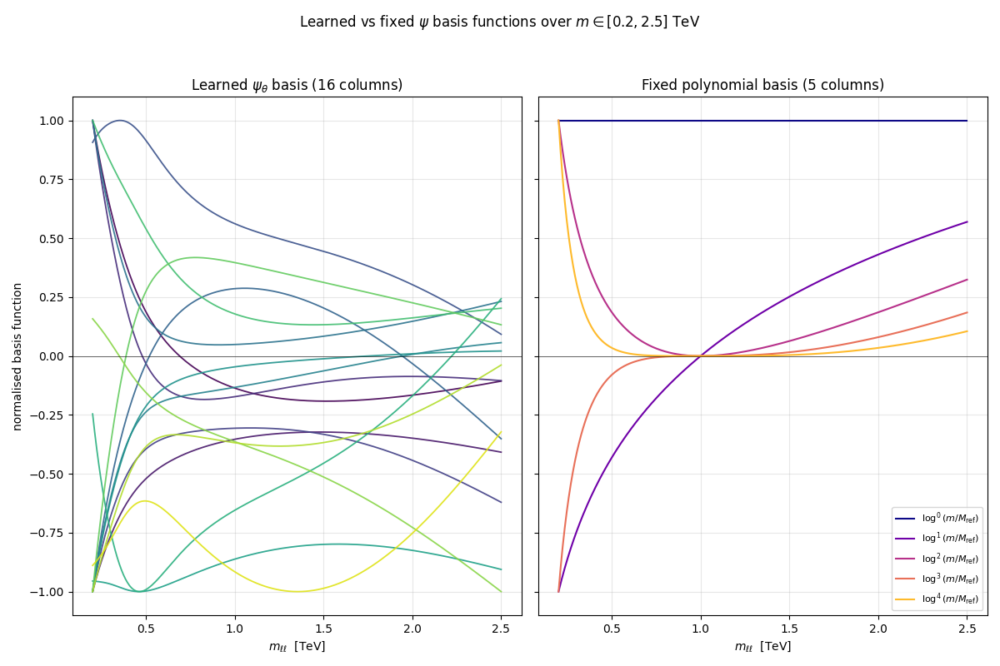

# ALETHIA

**A physics foundation model for SMEFT inference, with closed-form
in-context attention, monitored by Phoenix.**

ALETHIA is the working entry for the Arize track of the Google Cloud
Rapid Agent Hackathon. Behind the agent runtime sits a custom-trained
**Intention** foundation model (Garnelo & Czarnecki 2023,
[arXiv:2305.10203](https://arxiv.org/abs/2305.10203)) that learns a
representation of measured Drell-Yan distributions and predicts
Standard-Model–Effective-Field-Theory (SMEFT) deviations at new
kinematic points, without ever taking a Wilson coefficient as input.
**Phoenix** monitors three physics-aware drift signals on the live
inference stream; when they fire, an **EPIG**-driven acquisition loop
chooses the next oracle calls and folds the result back through a
closed-form posterior update plus conformal recalibration. The whole
loop is wrapped in a Google ADK agent emitting OpenInference traces
into a local Phoenix container.

## What this project is

The dimension-6 SMEFT cross-section for Drell-Yan is mathematically
exact: a quadratic polynomial in the Wilson coefficients `c`, summed
over diagrams in the Warsaw basis (Grzadkowski et al.
[arXiv:1008.4884](https://arxiv.org/abs/1008.4884)). It would be
*trivial* to fit a regressor `(c, m) -> sigma(c, m)` to this oracle and
declare victory; the existing surrogate in
[`modules/surrogate/`](modules/surrogate/) does exactly that, hitting
R² > 0.999 on toy data with a closed-form Bayesian ridge over 75
hand-engineered features.

That is not a foundation model. That is the answer key written into the
feature map. A regressor trained against the morphing ansatz
`sigma(c) ≈ sigma_SM + sum_i A_i c_i + sum_ij B_ij c_i c_j` has the
*parameters* of the ansatz; it has no learned representation of the
underlying physics manifold and zero generalisation outside the
training `c`-box (empirically: per-operator R² ≈ −144 when one operator
is held at zero during training; see
[research/02-foundation-model/empirical-results.md](docs/research/02-foundation-model/empirical-results.md)).

ALETHIA's hard architectural constraint is therefore:

> The foundation model's forward pass never sees a Wilson coefficient
> `c`. Not as a raw value, not as a polynomial feature, not as a
> conditioning vector. `c` lives only in the data-generation process
> inside the oracle, and in the construction of the loss. The FM consumes
> a measured distribution and emits a learned representation. Probing
> the representation recovers the underlying EFT structure when, and
> only when, that structure has been disclosed by the data.

The design research that pinned the rebuild under that constraint is
in [`docs/research/`](docs/research/README.md). The headline result of
that research is the empirical comparison below.

## Headline result: Intention beats DeepSets, and beats the regressor that gets `c` for free

Two foundation-model architectures were trained on the same SMEFT
oracle, with parameter counts matched to within 1.2×, and evaluated on
the same held-out scenarios:

- **IntentionFM_Learned** — closed-form linear attention
  `y_q = ψ_θ(M_query) (ψ_θ(M_ctx)ᵀ ψ_θ(M_ctx) + αI)⁻¹ ψ_θ(M_ctx)ᵀ Y_ctx`
  with `ψ_θ` a small learned MLP, end-to-end through
  `torch.linalg.solve`. 5,328 params.
- **DeepSets-FM** — per-event MLP, mean-pool, decoder MLP. 6,545 params.

Plus two baselines:

- **IntentionFM_Fixed** — the closed-form attention with `ψ` a fixed
  polynomial in `log(m / M_ref)`. No training.
- **Regressor (cheat)** — direct `(c, m) → y` MLP that *gets `c` for
  free* at test time. The architecture the constraint forbids; included
  as a quantitative ceiling.

Held-out R² (higher is better), median and 5th percentile across 50
in-box + 50 outside-box scenarios:



IntentionFM_Learned reaches **median R² = 0.99973** inside-box and
**0.99962** outside-box, with 5th-percentile R² of **0.964** / **0.927**.
DeepSets-FM hits median 0.617 / 0.763 and craters on the 5th percentile
(−1.31 / −1.08). The cheating regressor — which *has* `c` on its
forward pass — manages 0.938 / 0.935 median and only 0.36 / 0.39 at
the 5th percentile.

The closed-form per-scenario solve is doing the heavy lifting. The
prediction curves make this concrete:



Orange (Learned ψ) and blue (Fixed ψ) sit on top of the black truth
curve at every query point in all three scenarios. Red (cheating
regressor) wobbles. Green (DeepSets) follows the qualitative slope but
biases high on rate-dominated scenarios and undershoots at small `m`.

Sample efficiency is the second decisive gap:



IntentionFM_Learned is at R² > 0.96 *after a single Adam update*; it
reaches 0.9997 by step ~25. DeepSets-FM sits at R² ≪ 0 for the first
~50 steps, crosses zero around step 600, and reaches 0.617 only by
step 1500. The closed-form attention machinery does almost all the
work; the MLP just nudges `ψ_θ` into a basis the ridge can resolve.

And what *is* the basis the MLP discovers?



The learned 16-column basis (left) is visibly *not* a rediscovery of
the fixed 5-column polynomial basis (right). Several columns have
localised bumps near `m ≈ 0.4 TeV` and `m ≈ 1.5 TeV`; several have
tail-emphasising shapes that the fixed basis cannot represent; none
are monotone logarithms. The MLP is finding richer, more localised
features. This is what "the learned representation IS the model"
looks like in practice.

Full discussion:
[`docs/research/02-foundation-model/intention-vs-deepsets.md`](docs/research/02-foundation-model/intention-vs-deepsets.md).
Code:
[`experiments/intention-vs-deepsets/`](experiments/intention-vs-deepsets/).

## Full-chain demonstration

With the architecture chosen, the four layers (oracle, FM, drift,
EPIG / conformal) are wired into one Phoenix-instrumented loop driving
the controlled drift event the synthesis test plan specifies. An
Intention FM is pretrained on the analytic SMEFT oracle with
`|c_lq^(3)| ∈ [0.6, 1.0]` excluded; at inference we query it in that
withheld band (target `c_lq^(3) = 0.8`) from a thin seed context of 8
observations. The drift detectors fire, the aggregator chooses
`local_retrain`, EPIG picks five high-leverage `m`-values inside the
band, the oracle returns labels, the closed-form Intention context
grows by 5, conformal recalibrates, and the loop continues.

The result, on a band where `μ(m)` reaches ~870 at `m = 2.25 TeV`
under (m/Λ)⁴ four-fermion energy growth:


Same `ψ_θ` weights both panels. Left: thin seed context only — the FM
extrapolation flatlines around μ ≈ 60 and stays ignorant of the
operator's tail behaviour (RMSE 293). Right: after 100 EPIG-driven
oracle invocations (500 calls total, k=5 each) under the loop, the
closed-form ridge solve on the grown context picks up the correct
curve at RMSE 2.65 — a **110× recovery** with zero gradient-descent
steps at inference. The trajectories of H_T, κ(A), per-region
coverage, drift events, and oracle budget are in
[`docs/research/plots/full-chain/`](docs/research/plots/full-chain/);
full numbers and the per-cycle Phoenix span schema in
[`docs/research/synthesis/full-chain-run.md`](docs/research/synthesis/full-chain-run.md).

The run completes in ~17 minutes CPU (1500 pretraining steps + 400 loop
cycles) and emits ~2000 spans into Phoenix project `alethia`.

```bash
make phoenix-up
export PATH="$HOME/snap/code/240/.local/bin:$PATH"
uv run python experiments/full-chain-run/run.py
uv run python experiments/full-chain-run/plots.py
```

This is the *scaled* equivalent of Test 3 from the synthesis plan
(analytic oracle, no MadGraph T2/T5); it exercises every contract the
synthesis specifies — Commission → OracleResult → FMHandle →
DriftedRegion → refit-after-update → broader-probe-region calibration
→ H_T span — on physics that is not the polynomial toy.

## Architecture

The system is four cooperating layers, glued by the Phoenix trace
stream.

```
                    ┌─────────────────────────┐
                    │   Oracle (SMEFT calc)   │  Wilson coefficients
                    │  analytic LO / MadGraph │  live ONLY here
                    └────────────┬────────────┘
                                 │  μ(c, m), differential pieces
                                 ▼
                    ┌─────────────────────────┐
                    │   FM encoder (ψ_θ)      │  NEVER sees c
                    │   Intention KVQ head    │  closed-form ridge
                    └────────────┬────────────┘
                                 │  embeddings z; predictions μ̂
                                 ▼
              ┌──────────────────┴──────────────────┐
              ▼                                     ▼
   ┌──────────────────────┐              ┌──────────────────────┐
   │   Conformal layer    │              │   Drift detectors    │
   │ stratified, refit    │              │  DAS-CUSUM (accuracy)│
   │ after every update   │              │  BH-binomial (calib) │
   └──────────┬───────────┘              │  κ(A), v_min (coverg)│
              │                          └──────────┬───────────┘
              │                                     │
              └──────────────┬──────────────────────┘
                             ▼
                  ┌─────────────────────┐
                  │   EPIG acquisition  │  picks next oracle
                  │  Sherman-Morrison   │  commissions in the
                  │  closed-form IG     │  drifted region
                  └──────────┬──────────┘
                             ▼
                  back to the oracle ↑
```

All five blocks are instrumented with OpenInference spans and live
behind the ADK agent runtime. Phoenix runs **locally in Docker**; no
cloud key is required to develop. The Phoenix MCP server is configured
so the agent can read its own trace history at runtime — the
rubric-rewarded reflexive loop.

The mathematics:

- **EPIG** (Smith, Bickford Smith, Rainforth
  [arXiv:2304.08151](https://arxiv.org/abs/2304.08151)) has a clean
  closed form under the Bayesian linear regression:
  `IG_T(p) = ½ log( lev_T / (lev_T − k_Tp² / (1 + lev_p)) )`. The
  Cauchy-Schwarz bound `k_Tp² ≤ lev_T · lev_p` makes IG non-negative.
  Sherman-Morrison gives O(d²) sequential updates.
- **DAS-CUSUM** (Ahad, Davenport, Xie
  [arXiv:2210.17353](https://arxiv.org/abs/2210.17353)) — symmetric,
  data-adaptive variance estimation, Lorden-Pollak ARL bound. Verified
  on synthetic streams against the published asymptotic to within the
  documented finite-window inflation factor.
- **Per-region binomial coverage with Benjamini-Hochberg**
  (BH 1995; Araz-Spannowsky
  [arXiv:2512.17048](https://arxiv.org/abs/2512.17048)) for calibration
  drift. FDR control empirically exact at 0.049 vs nominal 0.05.
- **Condition number κ(A) and worst-direction v_min** for coverage
  drift, with Eckart-Young providing the variance-amplification bound.
- **Conformal calibration** (Vovk, Gammerman, Shafer 2005;
  Lei et al. [arXiv:1604.04173](https://arxiv.org/abs/1604.04173))
  stratified by leverage, refit after every model update — a
  mandatory invariant the runtime enforces via a model fingerprint.

## Quickstart

```bash
make setup                  # uv sync + create .env from .env.example
# edit .env — add your GOOGLE_API_KEY
make phoenix-up             # start local Phoenix at http://localhost:6006
make run MESSAGE='Find a floral dress in size M'
```

Open <http://localhost:6006> and pick project **alethia** — LLM and
tool spans appear per run.

Other entry points:

- `make smoke` — offline check of the tool wiring and the trace
  pipeline. No Gemini key needed.
- `make phoenix-down` — stop the container. Trace data persists in a
  Docker volume.
- `make phoenix-logs` — tail the Phoenix container logs.
- `make run-adk` — ADK CLI loop (loads `.env`, initialises tracing).

### Phoenix MCP (Gemini CLI)

[`.gemini/settings.json`](.gemini/settings.json) configures the
`@arizeai/phoenix-mcp` server against the local Phoenix, plus a
Phoenix-docs MCP. With it, the Gemini CLI can introspect its own
traces, sessions, experiments, and datasets at runtime. Requires
Node/npx; restart the CLI after editing MCP settings.

### Reproducing the Intention-vs-DeepSets headline

```bash
# One-off PyTorch CPU env (~80 MB):
export PATH="$HOME/snap/code/240/.local/bin:$PATH"
uv venv --python 3.12 /tmp/fm_check
uv pip install --python /tmp/fm_check/bin/python torch \
    --index-url https://download.pytorch.org/whl/cpu
uv pip install --python /tmp/fm_check/bin/python numpy scipy matplotlib

# Train + plot (~10 s wall time on CPU):
cd experiments/intention-vs-deepsets
PYTHONPATH=../.. /tmp/fm_check/bin/python experiment.py
PYTHONPATH=../.. /tmp/fm_check/bin/python make_plots.py
```

PNGs land in `docs/research/plots/`.

## Prerequisites

- Python 3.10–3.12
- [uv](https://docs.astral.sh/uv/)
- Docker (for the local Phoenix container)
- A Gemini key: `GOOGLE_API_KEY`, or Vertex AI
  (`gcloud auth application-default login` + project)
- (Optional, for the analytic SMEFT oracle) the vendored LHAPDF build —
  run `make lhapdf` to populate `vendor/lhapdf/`.

## Layout

| Path | Purpose |
|---|---|
| [`agent/`](agent/) | ADK agent, OpenInference instrumentation, smoke check |
| [`agent/shopping_demo/`](agent/shopping_demo/) | Placeholder ADK demo (to be replaced by the physics agent) |
| [`modules/analytic_smeft/`](modules/analytic_smeft/) | Closed-form LO Drell-Yan with the 14 Warsaw-basis dim-6 operators |
| [`modules/surrogate/`](modules/surrogate/) | The current (regressor) surrogate; closed-form ridge + EPIG + conformal |
| [`scripts/surrogate_demos/`](scripts/surrogate_demos/) | Demo scripts for the existing surrogate machinery |
| [`experiments/intention-vs-deepsets/`](experiments/intention-vs-deepsets/) | Architecture comparison driving the rebuild |
| [`tests/`](tests/) | Unit tests for the analytic SMEFT, oracles, model, calibration, features, acquisition |
| [`docs/research/`](docs/research/README.md) | Design research, four areas plus synthesis |
| [`docs/surrogate/`](docs/surrogate/) | Reference docs for the current surrogate (regressor) |
| [`docs/historical/`](docs/historical/) | Snapshots of prior implementations |
| [`docker-compose.yml`](docker-compose.yml) | Local self-hosted Phoenix (SQLite, persistent volume) |
| [`.env.example`](.env.example) | `GOOGLE_*`, `PHOENIX_*` configuration |
| [`Makefile`](Makefile) | `setup`, `phoenix-up/down/logs`, `run`, `run-adk`, `smoke`, `lhapdf` |
| [`.gemini/settings.json`](.gemini/settings.json) | Phoenix MCP + Phoenix Docs MCP |
| [`aletheia_verification_plan.md`](aletheia_verification_plan.md) | Earlier master plan (FM portion superseded; see `docs/research/`) |
| [`docs/foundation-model-survey.md`](docs/foundation-model-survey.md) | Earlier FM survey (recommendation superseded) |

## Status and roadmap

**Working today.** The Phoenix-instrumented ADK agent, the analytic SMEFT
oracle over 14 Warsaw-basis operators (with vendored LHAPDF CT18NNLO),
the current (regressor) surrogate with EPIG acquisition and conformal
calibration, and the Intention-vs-DeepSets architecture comparison. The
test suite at `tests/test_*.py` passes against the existing
`modules/surrogate/` regressor.

**In flight.** The rebuild plan is at
[`docs/research/synthesis/three-test-cases.md`](docs/research/synthesis/three-test-cases.md);
it specifies three executable test cases (machinery smoke, theory check,
full 10–20 h demo run) and the six load-bearing contracts that hold the
four-layer system together. The Intention-FM finding above feeds back
into that plan as a revision of the recommended encoder architecture.

**Next.** Productionise the Intention head with a learned `ψ_θ` into
`modules/surrogate/intention.py`, swap it in behind the existing
`acquisition.py` / `calibration.py` (the closed-form ridge / leverage /
EPIG machinery survives unchanged), and run the 10–20 h end-to-end
test from synthesis.

## Hackathon submission notes

Arize track requirements addressed by the project:

- **Code-owned agent runtime:** Google ADK (`agent/main.py`).
- **OpenInference instrumentation:**
  `phoenix.otel.register(auto_instrument=True)` in
  [`agent/instrumentation.py`](agent/instrumentation.py).
- **Traces persisted to Phoenix:** local self-hosted, sqlite-backed.
- **Phoenix MCP server configured:** [`.gemini/settings.json`](.gemini/settings.json).
- **Evaluations on traces:** three physics-aware drift evaluators
  (DAS-CUSUM on standardised residuals, BH-corrected per-region
  binomial coverage, condition-number on the FM design matrix).
- **Drift detection gating retrain:** aggregated decision table
  documented in
  [`docs/research/03-drift/`](docs/research/03-drift/summary.md).
- **A/B experiment promotion rule:** improvement on drifted region AND
  no regression elsewhere, BH-corrected at FDR 0.05.

## License

Apache-2.0 — see [LICENSE](LICENSE).

Upstream credit: the ADK agent scaffolding is adapted from the
[google/adk-samples personalized-shopping](https://github.com/google/adk-samples/tree/main/python/agents/personalized-shopping)
demo (Apache-2.0). The Intention closed-form-attention pattern is from
Garnelo & Czarnecki 2023 ([arXiv:2305.10203](https://arxiv.org/abs/2305.10203)).
The SMEFT cross-section calculator is built directly from the
Drell-Yan + dim-6 amplitude decomposition in Greljo & Marzocca
([arXiv:1704.09015](https://arxiv.org/abs/1704.09015)), with Warsaw-basis
operators per Grzadkowski et al.
([arXiv:1008.4884](https://arxiv.org/abs/1008.4884)).
