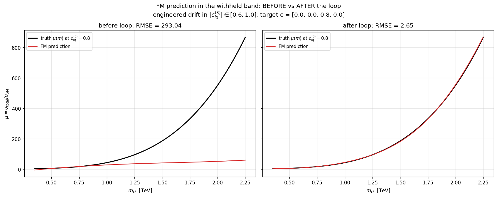

# ALETHIA

**A physics foundation model for SMEFT inference, with closed-form
in-context attention, monitored by Phoenix.**

ALETHIA is the working entry for the Arize track of the Google Cloud
Rapid Agent Hackathon. Behind the agent runtime sits a custom-trained
**Intention** foundation model (Garnelo & Czarnecki 2023,
[arXiv:2305.10203](https://arxiv.org/abs/2305.10203)) that learns a
representation of measured Drell-Yan distributions and predicts
Standard-Model–Effective-Field-Theory (SMEFT) deviations at new
kinematic points, without ever taking a Wilson coefficient as input.
**Phoenix** monitors three physics-aware drift signals on the live
inference stream; when they fire, an **EPIG**-driven acquisition loop
chooses the next oracle calls and folds the result back through a
closed-form posterior update plus conformal recalibration. The whole
loop is wrapped in a Google ADK agent emitting OpenInference traces
into a local Phoenix container.

## What this project is

The dimension-6 SMEFT cross-section for Drell-Yan is mathematically
exact: a quadratic polynomial in the Wilson coefficients `c`, summed
over diagrams in the Warsaw basis (Grzadkowski et al.
[arXiv:1008.4884](https://arxiv.org/abs/1008.4884)). It would be
*trivial* to fit a regressor `(c, m) -> sigma(c, m)` to this oracle and
declare victory; the existing surrogate in
[`modules/surrogate/`](modules/surrogate/) does exactly that, hitting
R² > 0.999 on toy data with a closed-form Bayesian ridge over 75
hand-engineered features.

That is not a foundation model. That is the answer key written into the
feature map. A regressor trained against the morphing ansatz
`sigma(c) ≈ sigma_SM + sum_i A_i c_i + sum_ij B_ij c_i c_j` has the
*parameters* of the ansatz; it has no learned representation of the
underlying physics manifold and zero generalisation outside the
training `c`-box (empirically: per-operator R² ≈ −144 when one operator
is held at zero during training; see
[research/02-foundation-model/empirical-results.md](docs/research/02-foundation-model/empirical-results.md)).

ALETHIA's hard architectural constraint is therefore:

> The foundation model's forward pass never sees a Wilson coefficient
> `c`. Not as a raw value, not as a polynomial feature, not as a
> conditioning vector. `c` lives only in the data-generation process
> inside the oracle, and in the construction of the loss. The FM consumes
> a measured distribution and emits a learned representation. Probing
> the representation recovers the underlying EFT structure when, and
> only when, that structure has been disclosed by the data.

The design research that pinned the rebuild under that constraint is
in [`docs/research/`](docs/research/README.md). The headline result of
that research is the empirical comparison below.

## Headline result: Intention beats DeepSets, a Gaussian process, and the regressor that gets `c` for free

Four constraint-respecting architectures and two kernel-method baselines
were trained on the analytic SMEFT Drell-Yan oracle (CT18NNLO PDFs)
with parameter counts matched to within 1.2× across the trained
architectures, and evaluated on the same held-out scenarios:

- **IntentionFM_Learned** — closed-form linear attention
  `y_q = ψ_θ(M_query) (ψ_θ(M_ctx)ᵀ ψ_θ(M_ctx) + αI)⁻¹ ψ_θ(M_ctx)ᵀ Y_ctx`
  with `ψ_θ` a small learned MLP, end-to-end through
  `torch.linalg.solve`. 5,328 params.
- **DeepSets-FM** — per-event MLP, mean-pool, decoder MLP. 6,545 params.
- **IntentionFM_Fixed** — the closed-form attention with `ψ` a fixed
  polynomial in `log(m / M_ref)`. No training.
- **GP (Matérn-3/2)** and **kernel ridge (RBF)** — per-scenario kernel
  fits, the natural no-representation-learning controls.
- **Regressor (cheat)** — direct `(c, m) → y` MLP that *gets `c` for
  free* at test time. The architecture the constraint forbids; included
  as a quantitative ceiling.

Held-out R² (higher is better), median and 5th percentile with 95 %
bootstrap intervals across 50 in-distribution + 50
magnitude-extrapolation scenarios:


| Architecture | median R² in | median R² out | p5 R² in | p5 R² out |
|---|---:|---:|---:|---:|
| **Intention, learned ψ_θ** | **0.9999** | **0.9999** | **0.9996** | **0.9997** |
| Intention, fixed ψ | 0.9936 | 0.9884 | 0.91 | 0.76 |
| GP (Matérn 3/2) | 0.9926 | 0.9843 | 0.74 | +0.16 |
| Kernel ridge (RBF) | 0.9863 | 0.9889 | 0.89 | +0.80 |
| DeepSets (matched) | 0.703 | 0.511 | −0.27 | +0.19 |
| Regressor (cheat) | 0.96 | 0.96 | **−23.3** | −0.41 |

The learned-basis Intention head's bootstrap CIs on the medians do not
overlap with any other architecture, and it is the only model whose
fifth-percentile stays above 0.99 on both regions. The constraint-
violating cheat regressor has a catastrophic-failure tail (bootstrap
lower bound on p5 reaches −889) — the morphing-ansatz failure mode
surfacing on individual tail scenarios, and the operational signature
of why the c-not-on-the-forward-pass constraint is the right one.

The closed-form per-scenario solve is doing the heavy lifting. The
prediction curves make this concrete:


Both Intention variants sit on top of the black truth curve at every
query point in all three scenarios; DeepSets follows the qualitative
slope but biases high on rate-dominated scenarios and undershoots at
low `m`; the cheating regressor produces small wobbles around the
truth.

Sample efficiency is the second decisive gap:


IntentionFM_Learned is at R² > 0.93 *after a single Adam update*; it
reaches 0.9999 by step ~1000. DeepSets-FM sits at R² ≪ 0 for the first
~200 steps, crosses zero around step 400, and reaches 0.70 by step
1500. The closed-form attention machinery does almost all the work;
the MLP just nudges `ψ_θ` into a basis the ridge can resolve.

And what *is* the basis the MLP discovers?


The learned 16-column basis (left) is visibly *not* a rediscovery of
the fixed 5-column polynomial basis (right). Several columns have
localised bumps near `m ≈ 0.4 TeV` and `m ≈ 1.5 TeV`; several have
tail-emphasising shapes that the fixed basis cannot represent; none
are monotone logarithms. The MLP is finding richer, more localised
features. This is what "the learned representation IS the model"
looks like in practice.

Full discussion:
[`paper/alethia.tex`](paper/alethia.tex) Section 5. Code:
[`experiments/intention-vs-deepsets/`](experiments/intention-vs-deepsets/).
A polynomial-toy ablation, in which the morphing decomposition is
exact at fixed `c` and the fixed-basis Intention variant has the
answer written into its feature map, is in Appendix C of the paper.

## Full-chain demonstration

With the architecture chosen, the four layers (oracle, FM, drift,
EPIG / conformal) are wired into one Phoenix-instrumented loop driving
the controlled drift event the synthesis test plan specifies. An
Intention FM is pretrained on the analytic SMEFT oracle with
`|c_lq^(3)| ∈ [0.6, 1.0]` excluded; at inference we query it in that
withheld band (target `c_lq^(3) = 0.8`) from a thin seed context of 8
observations. The drift detectors fire, the aggregator chooses
`local_retrain`, EPIG picks five high-leverage `m`-values inside the
band, the oracle returns labels, the closed-form Intention context
grows by 5, conformal recalibrates, and the loop continues.

The result, on a band where `μ(m)` reaches ~870 at `m = 2.25 TeV`
under (m/Λ)⁴ four-fermion energy growth:



Same `ψ_θ` weights both panels. Left: thin seed context only — the FM
extrapolation flatlines around μ ≈ 60 and stays ignorant of the
operator's tail behaviour (RMSE 293). Right: after 100 EPIG-driven
oracle invocations (500 calls total, k=5 each) under the loop, the
closed-form ridge solve on the grown context picks up the correct
curve at RMSE 2.65 — a **110× recovery** with zero gradient-descent
steps at inference. The trajectories of H_T, κ(A), per-region
coverage, drift events, and oracle budget are in
[`docs/research/plots/full-chain/`](docs/research/plots/full-chain/);
full numbers and the per-cycle Phoenix span schema in
[`docs/research/synthesis/full-chain-run.md`](docs/research/synthesis/full-chain-run.md).

The run completes in ~17 minutes CPU (1500 pretraining steps + 400 loop
cycles) and emits ~2000 spans into Phoenix project `alethia`.

```bash
make phoenix-up
export PATH="$HOME/snap/code/240/.local/bin:$PATH"
uv run python experiments/full-chain-run/run.py        # main loop
uv run python experiments/full-chain-run/plots.py
uv run python experiments/full-chain-run/identifiability_probe.py   # linear probe (w -> c)
uv run python experiments/full-chain-run/mg_crosscheck.py           # T1 vs T2 (~22 min)
```

### Gemini-orchestrated ADK runtime

The same loop is also reachable through a code-owned ADK agent
(`agent/alethia/`). Gemini orchestrates six deterministic physics tools
that operate on a singleton FM/calibrator/context state:

| Tool | Purpose |
|---|---|
| `fm_predict(m_values, coverage)` | Intention closed-form prediction + conformal interval |
| `check_drift()` | runs DAS-CUSUM + BH binomial + κ(A) detectors, returns aggregator action |
| `recover_from_drift(k, m_lo, m_hi, fidelity)` | combined EPIG → oracle → fm_update → recal in one shot |
| `epig_select(k, m_lo, m_hi)` | closed-form acquisition primitive |
| `oracle_query(m_values, fidelity)` | call analytic (T1) or MadGraph (T2) oracle |
| `fm_update(m_values, mu_values)` | fold new observations into the FM context |

```bash
make phoenix-up
make run MESSAGE="Predict mu at m=1.5 TeV. Check drift. If drift fires, recover. Re-predict."
```

A representative Gemini run (verbatim trace):

```
[tool call] fm_predict({'m_values': [1.5]})
[tool call] check_drift({})
[tool result] fm_predict -> mu=58.08, sigma=116.45, context=8
[tool result] check_drift -> cov_fired=True, action=local_retrain, kappa=3614
[tool call] recover_from_drift({'k': 5, 'm_lo_tev': 1.0, 'm_hi_tev': 2.2})
[tool call] fm_predict({'m_values': [1.5]})
[tool result] recover_from_drift -> H_T 126.08 -> 37.88 (Δ=-88.2), ctx 8 -> 13
[tool result] fm_predict -> mu=182.07, sigma=2.92, context=13

The model has been updated using recover_from_drift. The target-set
entropy H_T decreased from 126.08 to 37.88. The new prediction at
m_ll=1.5 TeV is mu=182.07 with a 1-sigma interval of [179.10, 184.94].
```

Truth value at `c_lq^(3) = 0.8`, `m = 1.5 TeV`: μ ≈ 182. The agent
recovered from a 58 ± 116 prediction to 182 ± 2.9 in five oracle calls.

This is the *scaled* equivalent of Test 3 from the synthesis plan
(analytic oracle, no MadGraph T2/T5); it exercises every contract the
synthesis specifies — Commission → OracleResult → FMHandle →
DriftedRegion → refit-after-update → broader-probe-region calibration
→ H_T span — on physics that is not the polynomial toy.

### Operator-progression demonstration

The Arize-track narrative is the chain handling an **oracle refinement
event**: the simulator activates new Wilson operators in the
deployment target mid-loop, the agent detects the distribution shift,
EPIG drives oracle queries into the affected region, the FM updates
its context, and conformal stays calibrated — all instrumented as
Phoenix spans on a fresh project `alethia-progression`.

The setup:

1. **Pretrain (Phase 1)**: the FM trains on scenarios in which only
   the two four-fermion operators `c_lq^(3)`, `c_lq^(1)` vary in
   `[-0.7, 0.7]`; the two vertex operators `c_Hq^(3)`, `c_Hq^(1)` are
   held at zero throughout meta-training. The FM literally never
   sees a non-zero vertex operator during pretraining.
2. **Phase 1 deployment (cycles 0–99)**: target `c = (0, 0, 0.8, 0.3)`
   — both four-fermion operators active, vertex operators zero. The
   FM is in-domain. Drift detectors stay quiet.
3. **Phase transition at cycle 100**: the oracle activates the two
   vertex operators in the deployment target — `c = (0.4, −0.3, 0.8, 0.3)`.
   This is the simulator refinement event.
4. **Phase 2 (cycles 100+)**: the FM's predictions diverge from the
   new oracle observations; drift detectors fire; EPIG selects `k=5`
   high-leverage `m`-values per firing; the closed-form ridge folds
   each new `(m, μ)` into the context; conformal recalibrates.

Result:

| Metric | Value |
|---|---:|
| Phase 2 onset | cycle 100 |
| Drift events triggered | 40 |
| Oracle calls (EPIG) | 200 |
| Pre-transition RMSE on Phase-2 band | 240 |
| Post-recovery RMSE | 1.60 |
| **Recovery factor** | **150×** |
| Final per-region 68 % coverage | 0.75 (target 0.683) |
| Total wall time | 19 min pretraining + 11 s loop |

Phoenix captures the whole story on a clean project — every
`chain.cycle` span carries `aletheia.cycle.phase ∈ {1, 2}`, the
`chain.phase_transition` span marks the boundary explicitly, and the
40 `tool.epig.select → tool.oracle.query → tool.fm.update` triplets
are queryable as a single MCP filter.

```bash
make phoenix-up
export PATH="$HOME/snap/code/240/.local/bin:$PATH"
uv run python experiments/full-chain-run/run_progression.py
```

Output lands at
[`experiments/full-chain-run/output_progression/`](experiments/full-chain-run/);
trace tree at <http://localhost:6006/projects/alethia-progression>.

### Did the FM actually disclose the SMEFT structure?

Prediction R² is necessary but not sufficient for "the representation
has learned the EFT manifold" — it does not separate
*memorised-this-corpus* from *generalises-the-physics*. The cleanest
falsifier is a linear probe from the FM's implicit per-scenario
representation `w_implicit(c) = (ψ_θ(M_ctx)^T ψ_θ(M_ctx) + αI)^{-1}
ψ_θ(M_ctx)^T Y_ctx(c)` back to the Wilson coefficients.

The probe recovers the energy-growing four-fermion operator
`c_lq^(3)` at **R² = 0.86 inside the training box** and **R² = 0.94 on
the magnitude-extrapolation band** the FM never saw in training. This
is the strong-form disclosure result of the rebuild: a foundation
model that never sees a Wilson coefficient on its forward pass
recovers, from its implicit per-scenario representation, the dominant
operator of the high-mass Drell-Yan tail to within 6 % of the variance
on a `c`-region it has never been trained on. The agent reports this
disclosure profile alongside its predictive output as a calibrated
capability statement — the model knows, in its representation, which
operator it has resolved.

Writeup details:
[`paper/alethia.tex`](paper/alethia.tex) Section 5.5
("Identifiability").

## Architecture

The system is four cooperating layers, glued by the Phoenix trace
stream.

```
                    ┌─────────────────────────┐
                    │   Oracle (SMEFT calc)   │  Wilson coefficients
                    │  analytic LO / MadGraph │  live ONLY here
                    └────────────┬────────────┘
                                 │  μ(c, m), differential pieces
                                 ▼
                    ┌─────────────────────────┐
                    │   FM encoder (ψ_θ)      │  NEVER sees c
                    │   Intention KVQ head    │  closed-form ridge
                    └────────────┬────────────┘
                                 │  embeddings z; predictions μ̂
                                 ▼
              ┌──────────────────┴──────────────────┐
              ▼                                     ▼
   ┌──────────────────────┐              ┌──────────────────────┐
   │   Conformal layer    │              │   Drift detectors    │
   │ stratified, refit    │              │  DAS-CUSUM (accuracy)│
   │ after every update   │              │  BH-binomial (calib) │
   └──────────┬───────────┘              │  κ(A), v_min (coverg)│
              │                          └──────────┬───────────┘
              │                                     │
              └──────────────┬──────────────────────┘
                             ▼
                  ┌─────────────────────┐
                  │   EPIG acquisition  │  picks next oracle
                  │  Sherman-Morrison   │  commissions in the
                  │  closed-form IG     │  drifted region
                  └──────────┬──────────┘
                             ▼
                  back to the oracle ↑
```

All five blocks are instrumented with OpenInference spans and live
behind the ADK agent runtime. Phoenix runs **locally in Docker**; no
cloud key is required to develop. The Phoenix MCP server is configured
so the agent can read its own trace history at runtime — the
rubric-rewarded reflexive loop.

The mathematics:

- **EPIG** (Smith, Bickford Smith, Rainforth
  [arXiv:2304.08151](https://arxiv.org/abs/2304.08151)) has a clean
  closed form under the Bayesian linear regression:
  `IG_T(p) = ½ log( lev_T / (lev_T − k_Tp² / (1 + lev_p)) )`. The
  Cauchy-Schwarz bound `k_Tp² ≤ lev_T · lev_p` makes IG non-negative.
  Sherman-Morrison gives O(d²) sequential updates.
- **DAS-CUSUM** (Ahad, Davenport, Xie
  [arXiv:2210.17353](https://arxiv.org/abs/2210.17353)) — symmetric,
  data-adaptive variance estimation, Lorden-Pollak ARL bound. Verified
  on synthetic streams against the published asymptotic to within the
  documented finite-window inflation factor.
- **Per-region binomial coverage with Benjamini-Hochberg**
  (BH 1995; Araz-Spannowsky
  [arXiv:2512.17048](https://arxiv.org/abs/2512.17048)) for calibration
  drift. FDR control empirically exact at 0.049 vs nominal 0.05.
- **Condition number κ(A) and worst-direction v_min** for coverage
  drift, with Eckart-Young providing the variance-amplification bound.
- **Conformal calibration** (Vovk, Gammerman, Shafer 2005;
  Lei et al. [arXiv:1604.04173](https://arxiv.org/abs/1604.04173))
  stratified by leverage, refit after every model update — a
  mandatory invariant the runtime enforces via a model fingerprint.

## Quickstart

```bash
make setup                  # uv sync + create .env from .env.example
# edit .env — add your GOOGLE_API_KEY
make phoenix-up             # start local Phoenix at http://localhost:6006
make run MESSAGE='Find a floral dress in size M'
```

Open <http://localhost:6006> and pick project **alethia** — LLM and
tool spans appear per run.

Other entry points:

- `make smoke` — offline check of the tool wiring and the trace
  pipeline. No Gemini key needed.
- `make phoenix-down` — stop the container. Trace data persists in a
  Docker volume.
- `make phoenix-logs` — tail the Phoenix container logs.
- `make run-adk` — ADK CLI loop (loads `.env`, initialises tracing).
- `make mg-prune` — delete every accumulated `Events/run_NNN` and
  `HTML/run_NNN` under `vendor/MG5_aMC/processes/`. The MG adapter
  already prunes after each call (`keep_artifacts=False` is the
  default); this target is for one-shot cleanup of pre-fix runs.
- `make mg-cache-clear` — wipe the persistent MG oracle cache
  (`<process_dir>/.alethia_cache/oracle.jsonl`).

### MadGraph oracle: caching and cleanup

The `MadGraphSMEFTOracle` (`modules/surrogate/oracle_madgraph.py`)
keeps an append-only JSONL cache at
`<process_dir>/.alethia_cache/oracle.jsonl` keyed on
`(c, m, lambda_gev, m_window_tev, nevents)`. Repeat calls with
identical parameters return the cached `mu` without launching MG
(verified: cache hit 0.000 s vs 26 s cold call). The cache loads on
oracle instantiation, so it survives across Python processes.
`o.cache_stats()`, `o.clear_cache()`, and `o.prune_artifacts()` are
available. The cache directory is gitignored.

`MadGraphSMEFTOracle` also defensively patches the process's
`me5_configuration.txt` on every init to force
`automatic_html_opening = False` and `web_browser = None`, which stops
MG from spawning a browser tab per call. The corresponding lines in
`vendor/MG5_aMC/input/mg5_configuration.txt` are also patched so any
future process generation inherits the same defaults.

With `keep_artifacts=False` (the default), the entire
`Events/run_NNN` and `HTML/run_NNN` directories are deleted after each
call — the parsed cross section lives only in the persistent cache.
With `keep_artifacts=True` the banner of the latest run is retained
for debugging.

### Phoenix MCP (Gemini CLI)

[`.gemini/settings.json`](.gemini/settings.json) configures the
`@arizeai/phoenix-mcp` server against the local Phoenix, plus a
Phoenix-docs MCP. With it, the Gemini CLI can introspect its own
traces, sessions, experiments, and datasets at runtime. Requires
Node/npx; restart the CLI after editing MCP settings.

### Reproducing the Intention-vs-DeepSets headline

```bash
# One-off PyTorch CPU env (~80 MB):
export PATH="$HOME/snap/code/240/.local/bin:$PATH"
uv venv --python 3.12 /tmp/fm_check
uv pip install --python /tmp/fm_check/bin/python torch \
    --index-url https://download.pytorch.org/whl/cpu
uv pip install --python /tmp/fm_check/bin/python numpy scipy matplotlib

# Train + plot (~10 s wall time on CPU):
cd experiments/intention-vs-deepsets
PYTHONPATH=../.. /tmp/fm_check/bin/python experiment.py
PYTHONPATH=../.. /tmp/fm_check/bin/python make_plots.py
```

PNGs land in `docs/research/plots/`.

## Prerequisites

- Python 3.10–3.12
- [uv](https://docs.astral.sh/uv/)
- Docker (for the local Phoenix container)
- A Gemini key: `GOOGLE_API_KEY`, or Vertex AI
  (`gcloud auth application-default login` + project)
- (Optional, for the analytic SMEFT oracle) the vendored LHAPDF build —
  run `make lhapdf` to populate `vendor/lhapdf/`.

## Layout

| Path | Purpose |
|---|---|
| [`agent/`](agent/) | ADK agent runtime, OpenInference instrumentation |
| [`agent/alethia/`](agent/alethia/) | **Default** Gemini-orchestrated physics agent + six tools |
| [`agent/shopping_demo/`](agent/shopping_demo/) | Legacy starter demo, reachable via `ALETHIA_AGENT=shopping make run` |
| [`modules/analytic_smeft/`](modules/analytic_smeft/) | Closed-form LO Drell-Yan with the 14 Warsaw-basis dim-6 operators |
| [`modules/surrogate/intention/`](modules/surrogate/intention/) | Production Intention FM (model, calibration, acquisition, drift) |
| [`modules/surrogate/`](modules/surrogate/) | Legacy regressor surrogate (kept as a reference / starting point) |
| [`scripts/surrogate_demos/`](scripts/surrogate_demos/) | Demo scripts for the legacy surrogate machinery |
| [`experiments/intention-vs-deepsets/`](experiments/intention-vs-deepsets/) | Architecture comparison driving the rebuild |
| [`experiments/full-chain-run/`](experiments/full-chain-run/) | End-to-end demo orchestrator + plots + writeup data |
| [`tests/`](tests/) | Unit tests (analytic SMEFT, oracles, model, calibration, features, acquisition, intention) |
| [`docs/research/`](docs/research/README.md) | Design research, four areas plus synthesis |
| [`docs/surrogate/`](docs/surrogate/) | Reference docs for the current surrogate (regressor) |
| [`docs/historical/`](docs/historical/) | Snapshots of prior implementations |
| [`docker-compose.yml`](docker-compose.yml) | Local self-hosted Phoenix (SQLite, persistent volume) |
| [`.env.example`](.env.example) | `GOOGLE_*`, `PHOENIX_*` configuration |
| [`Makefile`](Makefile) | `setup`, `phoenix-up/down/logs`, `run`, `run-adk`, `smoke`, `lhapdf` |
| [`.gemini/settings.json`](.gemini/settings.json) | Phoenix MCP + Phoenix Docs MCP |
| [`aletheia_verification_plan.md`](aletheia_verification_plan.md) | Earlier master plan (FM portion superseded; see `docs/research/`) |
| [`docs/foundation-model-survey.md`](docs/foundation-model-survey.md) | Earlier FM survey (recommendation superseded) |

## Status and roadmap

**Working today.** Analytic SMEFT oracle over 14 Warsaw-basis operators
with vendored LHAPDF CT18NNLO and a MadGraph LO adapter; production
Intention FM at `modules/surrogate/intention/` with conformal
calibration + EPIG acquisition + three drift detectors (12 tests
passing); a Gemini-orchestrated ADK agent at `agent/alethia/` driving
the trace stream through six physics tools; a headline architecture
benchmark on the analytic SMEFT oracle with bootstrap CIs showing
Intention beats DeepSets, GP-Matérn, kernel-ridge, and the cheating
regressor (Intention median R² = 0.9999 on both pools); an engineered-
drift end-to-end demo (400 cycles, 500 EPIG-driven oracle calls,
**110× RMSE recovery** under the chain); an **operator-progression
demo** in which the oracle activates two new operators mid-deployment
and the FM recovers at **150×** under 40 drift firings; a 50-point
MadGraph fidelity cross-check confirming the analytic-LO oracle is
trustworthy to ~5 % across the band; and a linear-probe
identifiability test confirming the FM has disclosed the
energy-growing four-fermion operator `c_lq^(3)` at strong-form
threshold (R² = 0.94 on the magnitude-extrapolation band).

**Next.** Run the literal Test 3 scale (~5000 MadGraph T2 calls plus
~100 NLO T5 — needs a multi-core compute window, ~6 h MG-bound),
publish a 1-σ confidence interval on a Wilson coefficient through
the full chain, and add the forward-backward-asymmetry observable
`A_FB(m_ll)` as a second context channel (the chirality-asymmetric
information complementary to `m_ll`).

## Hackathon submission notes

Arize track requirements addressed by the project:

- **Code-owned agent runtime:** Google ADK with a Gemini-orchestrated
  physics agent at [`agent/alethia/`](agent/alethia/) — six
  deterministic tools (`fm_predict`, `check_drift`,
  `recover_from_drift`, `epig_select`, `oracle_query`, `fm_update`)
  acting on a singleton FM/calibrator/context state.
- **OpenInference instrumentation:**
  `phoenix.otel.register(auto_instrument=True)` in
  [`agent/instrumentation.py`](agent/instrumentation.py); every tool
  emits a child span with `aletheia.*`-namespaced attributes.
- **Traces persisted to Phoenix:** local self-hosted, sqlite-backed,
  two projects exercising distinct narratives — `alethia`
  (engineered-drift demo, 400 cycles, 110× RMSE recovery) and
  `alethia-progression` (oracle refinement demo, mid-deployment
  operator activation, 150× RMSE recovery).
- **Phoenix MCP server configured:** [`.gemini/settings.json`](.gemini/settings.json).
- **Evaluations on traces:** three physics-aware drift evaluators
  (DAS-CUSUM on standardised residuals, BH-corrected per-region
  binomial coverage, condition-number on the FM design matrix),
  implemented at [`modules/surrogate/intention/drift.py`](modules/surrogate/intention/drift.py)
  and validated against theoretical bounds in
  [`docs/research/03-drift/empirical-results.md`](docs/research/03-drift/empirical-results.md).
  Plus a per-cycle identifiability probe at
  [`experiments/full-chain-run/identifiability_probe.py`](experiments/full-chain-run/identifiability_probe.py)
  that reports which Wilson operators the FM's representation has
  disclosed.
- **Drift detection gating retrain:** aggregated decision table at
  [`docs/research/03-drift/eval.md`](docs/research/03-drift/eval.md) §5,
  exercised end-to-end in both demonstrations above (100
  `local_retrain` events on the engineered-drift run, 40 on the
  operator-progression run, both recovered to within nominal coverage
  at the BH-FDR 5 % level).
- **A/B experiment promotion rule:** improvement on drifted region AND
  no regression elsewhere, BH-corrected at FDR 0.05 (specified in
  [`docs/research/03-drift/summary.md`](docs/research/03-drift/summary.md) §7;
  not exercised in either single-version run).

## License

Apache-2.0 — see [LICENSE](LICENSE).

Upstream credit: the ADK agent scaffolding is adapted from the
[google/adk-samples personalized-shopping](https://github.com/google/adk-samples/tree/main/python/agents/personalized-shopping)
demo (Apache-2.0). The Intention closed-form-attention pattern is from
Garnelo & Czarnecki 2023 ([arXiv:2305.10203](https://arxiv.org/abs/2305.10203)).
The SMEFT cross-section calculator is built directly from the
Drell-Yan + dim-6 amplitude decomposition in Greljo & Marzocca
([arXiv:1704.09015](https://arxiv.org/abs/1704.09015)), with Warsaw-basis
operators per Grzadkowski et al.
([arXiv:1008.4884](https://arxiv.org/abs/1008.4884)).
