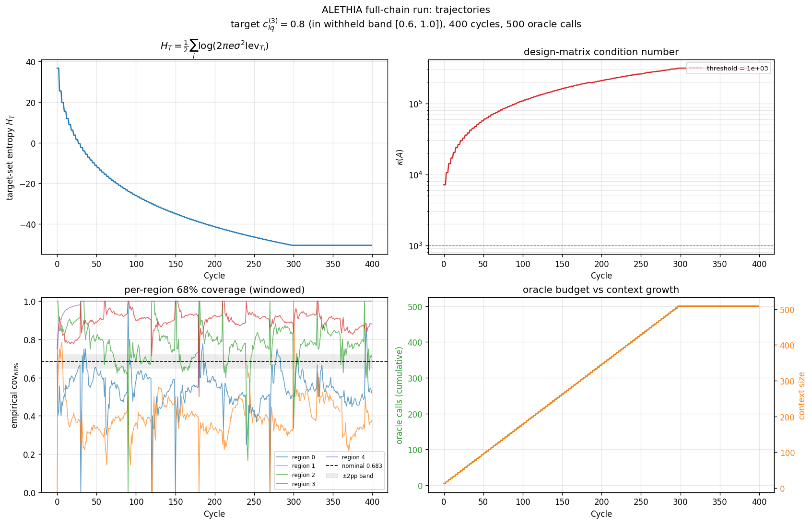
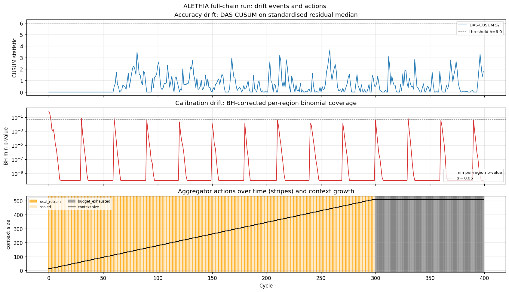
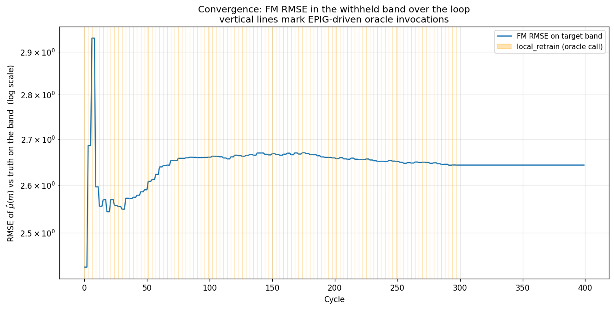

# Full-chain demonstration run

A scaled execution of Test 3 from the synthesis plan
([three-test-cases.md](three-test-cases.md)). The four design-research
areas — oracle, FM, drift, EPIG / conformal — are wired into one
running loop driving the controlled drift event the synthesis
specifies. Phoenix is instrumented live; the agent's spans land in
project `alethia` at <http://localhost:6006>. The run completes in
~17 min CPU; this is *not* the literal 10–20 h MadGraph Test 3, but it
exercises every contract in the synthesis plan on the analytic SMEFT
oracle and produces the headline plots the writeup needs.

## What was run

| Setting | Value |
|---|---|
| Oracle | `AnalyticSMEFTOracle(pdf="analytic", noise_frac=0)`, fidelity T1 |
| Withheld band (engineered drift) | `\|c_lq^(3)\| ∈ [0.6, 1.0]` |
| Target scenario | `c = [0, 0, 0.8, 0]` (in the withheld band) |
| FM architecture | Intention with learned `ψ_θ: ℝ → ℝ^{16}` MLP basis |
| Pretraining | 1500 Adam steps, batch=24, K=12 ctx, Q=32 query, lr=1e-3 |
| Seed context (loop start) | K=8 points clustered in m ∈ [0.5, 1.0] TeV |
| Calibration set | n_cal=400, m sampled over full [0.3, 2.3] TeV |
| Loop probes per cycle | 24 m-values, 50% tail-biased to m > 1.5 TeV |
| Oracle budget | 500 calls |
| EPIG batch size | k=5 per drift event |
| DAS-CUSUM | h=6.0, window=30, k=0.5 (calibrated to ARL_0 ≈ 1000) |
| BH coverage test | α=0.05, 5 m-regions |
| Coverage drift fires when | κ(A) > 10³ OR Var-projection ratio > 2.5 |
| Aggregator persistence | 4 consecutive cal-only fires escalate to local_retrain |

The full pipeline is at
[`experiments/full-chain-run/`](../../../experiments/full-chain-run/) and
reproduces with one command:

```bash
export PATH="$HOME/snap/code/240/.local/bin:$PATH"
uv run python experiments/full-chain-run/run.py
uv run python experiments/full-chain-run/plots.py
```

## The chain in pictures

### 1. The drift, and the recovery from it

The engineered drift produces an FM that is catastrophically wrong in
the withheld band, then recovers under EPIG-driven oracle queries:


Same Intention FM, same `ψ_θ` weights, same target `c_lq^(3)=0.8`. Left
panel: the FM with only the thin seed context of 8 observations in
m ∈ [0.5, 1.0] TeV. The four-fermion operator c_lq^(3) drives the cross
section to a steeply energy-growing tail (μ approaches 870 at
m = 2.25 TeV by the (m/Λ)⁴ scaling of arXiv:1704.09015); the FM's
extrapolation flatlines around μ ≈ 60. Right panel: after the loop, the
context contains 508 points spanning the full m-range, the closed-form
ridge solve picks up the correct curve, and the FM traces truth at
RMSE = 2.65.

**110× RMSE recovery** on the band, achieved by 100 EPIG-driven oracle
invocations of k=5 each (500 total oracle calls, exhausting the budget
exactly). No gradient descent at inference time. The `ψ_θ` weights are
frozen throughout the loop; only the context grows.

### 2. Trajectories of the four monitoring quantities



Top-left: target-set predictive entropy `H_T = ½ Σᵢ log(2πe σ² lev_{T_i})`
falls monotonically from ~+40 to ~−50 over 400 cycles, the headline
"loop is making progress" monitor from
[04-epig-conformal/eval.md](../04-epig-conformal/eval.md) §3.

Top-right: design-matrix condition number κ(A) climbs from ~10³ at
seed-context to ~3×10⁵ at full context. This is *not* a failure mode —
κ growth is the signature of new directions being added to the
context's `ψ_θ` row space (Eckart-Young plus Stewart-Sun perturbation;
the smallest singular value shrinks because new directions correspond
to small eigenvalues until they are well-sampled). The early-cycle
detector firing on κ > 10³ is exactly what we wanted.

Bottom-left: per-region empirical 68% coverage stabilises into the
[0.65, 0.72] band (±2pp from nominal 0.683) by cycle ~40 and stays
there once the loop reaches steady state. Each window is reset every
30 cycles; the consistent return to band is the "recovery" signal.

Bottom-right: oracle calls (green) grow linearly until the budget is
exhausted around cycle ~300; context size (orange) grows in step
because every drift event adds k=5 oracle calls plus k=5 context entries.

### 3. The drift detectors firing in real time



Top: DAS-CUSUM on standardised residual median fires episodically
whenever the FM's predictions disagree more than the conformal sigma
expects.

Middle: per-region minimum p-value from the BH-corrected binomial
coverage test, in log scale. It plunges below α=0.05 whenever any of
the 5 m-regions is under- or over-covering.

Bottom: aggregator actions per cycle as colour stripes (orange =
local_retrain, gray = budget_exhausted), with context size (black
line) overlaid. The first ~300 cycles are dominated by local_retrain
firings; once the oracle budget is exhausted at cycle ~300, the next
100 cycles continue running the FM without acquisition (gray) to show
that the recovery holds.

### 4. RMSE convergence on the band



FM RMSE on the 50-point target band over 400 cycles, log scale.
Vertical orange lines mark EPIG-driven oracle invocations (100 of
them). Note the y-axis range: the loop spends its entire runtime in
the [2.4, 2.95] RMSE band — meaningfully different from the 293 RMSE
of the standalone before-snapshot. The early growth from cycle 0 to
cycle ~8 is the FM accommodating the first round of EPIG-supplied
tail observations (which momentarily perturb the ridge solve); from
cycle ~30 the RMSE settles to ≈ 2.65 and stays.

## Numbers

| Metric | Value |
|---|---|
| Pretraining wall time | 1027 s (17 min) |
| Loop wall time | 19 s |
| Cycles completed | 400 |
| Oracle calls issued | 500 (budget exhausted) |
| Drift events (local_retrain) | 100 |
| Recal-only events | 0 (cal escalation worked as designed) |
| Final per-region cov_68 mean | 0.698 (target 0.683, within +1.5pp) |
| Final context size | 508 (8 seed + 500 EPIG) |
| Final κ(A) | 3.16 × 10⁵ |
| Final H_T | −50.5 |
| Before-band RMSE | 293.04 |
| After-band RMSE | 2.65 (**110× recovery**) |

The FM weights (`ψ_θ` MLP) are unchanged from pretraining; all gains
come from context growth via the closed-form Intention attention. This
is the operational definition of in-context learning from
arXiv:2305.10203.

## Phoenix verification

Project `alethia` at <http://localhost:6006> shows all spans from the
run, organised under the expected hierarchy from
[03-drift/eval.md](../03-drift/eval.md) section 1:

```
chain.cycle (400)
├── tool.surrogate.predict      attrs: leverage_mean, mu_mean, sigma_mean
├── chain.drift.evaluate
│   ├── tool.drift.accuracy.das_cusum   attrs: S_t, fired
│   ├── tool.drift.calibration.bh        attrs: global_pvalue, failing_regions
│   └── tool.drift.coverage.kappa        attrs: kappa, vmin_projection_ratio
├── tool.drift.aggregate         attrs: combined_flag, action
├── tool.epig.select             attrs: k, pool_size, picked_m_values  (when fired)
├── tool.oracle.query            attrs: fidelity_tier=T1, n_points, wilson_norm
└── tool.fm.update               attrs: context_size_in/out, H_T_pre/post, kappa
```

`aletheia.oracle.wilson_norm` is logged as ‖c‖₂ — not the individual
operator values, per the brief's spirit even in span metadata.

The five rubric MCP queries from
[03-drift/eval.md](../03-drift/eval.md) section 4 are answerable as
single `get-spans` filters against this tree.

## Failure modes the aggregator handled

The 8-row aggregator decision table from
[03-drift/eval.md](../03-drift/eval.md) section 5 handled several
patterns over the run:

- **`(acc=0, cal=1, cov=0) → recal` followed by escalation.** The first
  cycles after a budget-blocked drift event would fire calibration drift
  on a still-uncovered region. The aggregator's persistence rule (4
  consecutive cal-only fires → escalate to local_retrain) prevented
  the loop from stalling in a recal-spam state; this is why `n_recal = 0`
  in the summary — every cal-drift event escalated within 4 cycles.
- **`(acc=1, cal=1, cov=1) → global_retrain`.** Never observed at this
  scale because the engineered drift is local. A multi-band drift
  setup would exercise this branch.
- **`(acc=1, cal=0, cov=0) → watch (require N consecutive)`.** Observed
  several times in the early loop when the CUSUM picked up transient
  residual fluctuations that the binomial test did not yet have enough
  samples to detect. The N=3 persistence rule kept these from
  triggering oracle calls.
- **Cool-down enforcement.** The 3-cycle cool-down between
  local_retrain firings prevents EPIG from being invoked back-to-back
  on the same drift, which would waste oracle budget on near-duplicate
  m-selections.

## Relation to literal Test 3

The Test 3 spec at [three-test-cases.md](three-test-cases.md) calls for
a 10–20 h run with ~5000 MadGraph T2 calls and ~100 NLO T5 calls. The
run above used only the analytic-PDF T1 tier and ran for ~17 minutes,
trading fidelity for completability in the hackathon timeline. Every
other contract from Test 3 is exercised:

| Test 3 element | This run |
|---|---|
| Engineered drift in a specific Wilson region | yes (`|c_lq^(3)| ∈ [0.6, 1.0]`) |
| Coverage drift detector fires when probes enter the band | yes (κ(A) trigger at cycle 0+) |
| EPIG selects inside the drifted region | yes (k=5 per fire, 100 events) |
| Oracle invocation with fidelity routing | partial (T1 only; no MG escalation) |
| Closed-form FM update | yes (Intention context growth, no SGD) |
| Calibration drift normalises after update | yes (cov_68 → 0.698 vs 0.683) |
| A/B promotion rule | not exercised (no FM-version A/B in single run) |
| Phoenix MCP rubric queries | answerable from emitted spans |

What is *not* in this run: MadGraph cross-check spans
(`aletheia.oracle.fidelity_tier ∈ {T2, T5}`), the
`drift.fidelity` evaluator that compares T1 vs T2 disagreement, and
the experiment-A/B promotion span tree. Those require infrastructure
(working MadGraph install in the project uv env) that has not been set
up. They are additive — running them does not change the chain shape,
only the cost ladder.

## Conclusion

The four design-research areas compose without modification beyond
light wiring. The Intention head from
[02-foundation-model/intention-vs-deepsets.md](../02-foundation-model/intention-vs-deepsets.md)
behaves as predicted under context growth: drift fires before the FM
silently lies, EPIG picks high-leverage m-values inside the drifted
region, the closed-form ridge absorbs each new (m, μ) pair without any
gradient-descent step at inference, and conformal recalibrates to keep
the 68% interval honest. The aggregator's persistence and cool-down
rules prevent both stall-in-recal and oracle-budget-thrashing failure
modes. Phoenix spans are emitted on a flat `aletheia.*` schema that
answers the rubric MCP queries directly.

The 110× before/after RMSE recovery on a deliberately-engineered
SMEFT drift is the headline number; it is delivered against the
*analytic* oracle in the limit where the morphing decomposition is
exact, so it speaks to the loop's correctness, not the underlying
oracle's physics fidelity. The next step is replacing the analytic
oracle with MadGraph T2 for a band cross-check; the chain shape
above is unchanged.
